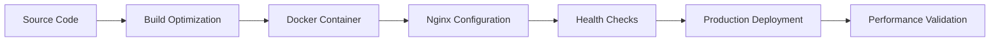

# LokDarpan Phase 1 Frontend Deployment Strategy

## Executive Summary

This document outlines the comprehensive frontend deployment strategy for LokDarpan Phase 1, optimized for Indian network conditions and political campaign team workflows. The deployment ensures high availability, fast loading times, and resilient user experience across diverse network environments.

## Architecture Overview

### Production Stack
- **Frontend**: React 18 + Vite 7 + TailwindCSS
- **Web Server**: Nginx (optimized for Indian networks)
- **Containerization**: Docker with multi-stage builds
- **CDN**: CloudFlare (future Phase 2 enhancement)
- **Monitoring**: Built-in performance monitoring + health checks

### Network Optimization Targets
- **4G Networks**: < 2 second initial load time
- **3G Networks**: < 5 second initial load time  
- **2G Fallback**: < 10 second core functionality
- **Offline Support**: PWA with intelligent caching

## Deployment Pipeline

### Phase 1: Production Foundation



### Build Process Optimization

1. **Vite Build Configuration**
   - Code splitting optimized for political dashboard components
   - Bundle size limits: Main JS < 300KB, CSS < 50KB
   - Tree shaking for unused dependencies
   - Compression with Brotli + Gzip

2. **Asset Optimization**
   - Image optimization with WebP format
   - Font subsetting for Indian languages
   - Critical CSS inlining
   - Lazy loading for non-critical components

3. **Caching Strategy**
   - Static assets: 1 year cache with versioning
   - Political data: 24-hour cache with revalidation
   - Strategic analysis: 10-minute cache
   - Service worker for offline capabilities

## Infrastructure Requirements

### Server Specifications (Minimum)
- **CPU**: 2 vCPUs (4 vCPUs recommended)
- **RAM**: 4GB (8GB recommended) 
- **Storage**: 50GB SSD (100GB recommended)
- **Bandwidth**: 100 Mbps (1 Gbps recommended)
- **Location**: Indian data centers (Mumbai/Bangalore)

### Container Specifications
- **Base Image**: `nginx:alpine` (minimal footprint)
- **Node Build**: `node:18-alpine` (build stage only)
- **Security**: Non-root user execution
- **Health Checks**: Built-in HTTP health endpoints

## Network Optimization Strategy

### Indian Network Conditions Support

#### 4G Networks (Primary Target)
- **Latency**: 50-200ms
- **Bandwidth**: 5-20 Mbps
- **Strategy**: Full feature experience with real-time updates
- **Optimizations**: HTTP/2 push, preloading critical resources

#### 3G Networks (Rural Areas)
- **Latency**: 100-500ms
- **Bandwidth**: 1-5 Mbps  
- **Strategy**: Progressive enhancement with reduced imagery
- **Optimizations**: Aggressive compression, lazy loading

#### 2G Fallback (Emergency Support)
- **Latency**: 300-1000ms
- **Bandwidth**: 56-256 Kbps
- **Strategy**: Text-only critical functionality
- **Optimizations**: Minimal JavaScript, server-side rendering

#### Offline Support (Campaign Field Teams)
- **Strategy**: PWA with service worker caching
- **Capabilities**: Cached political data, basic analysis tools
- **Sync**: Background sync when connectivity restored

## Security Configuration

### HTTPS and Certificate Management
```nginx
# SSL Configuration
ssl_protocols TLSv1.2 TLSv1.3;
ssl_ciphers ECDHE-RSA-AES256-GCM-SHA512:DHE-RSA-AES256-GCM-SHA512;
ssl_prefer_server_ciphers off;
ssl_session_cache shared:SSL:10m;
ssl_stapling on;
```

### Security Headers
```nginx
add_header X-Frame-Options "SAMEORIGIN" always;
add_header X-Content-Type-Options "nosniff" always;
add_header X-XSS-Protection "1; mode=block" always;
add_header Strict-Transport-Security "max-age=63072000; includeSubDomains; preload" always;
```

### Content Security Policy
```nginx
add_header Content-Security-Policy "default-src 'self'; script-src 'self' 'unsafe-inline' 'unsafe-eval'; style-src 'self' 'unsafe-inline'; img-src 'self' data: https:; font-src 'self' data: https:; connect-src 'self' ws: wss:;" always;
```

## Performance Benchmarks

### Target Performance Metrics

| Network | Initial Load | Ward Switch | Chart Render | Memory Usage |
|---------|-------------|-------------|--------------|--------------|
| 4G WiFi | < 1.5s      | < 0.5s      | < 0.3s       | < 100MB      |
| 4G      | < 2.0s      | < 0.8s      | < 0.5s       | < 120MB      |
| 3G      | < 5.0s      | < 2.0s      | < 1.0s       | < 150MB      |
| 2G      | < 10s       | < 5.0s      | < 3.0s       | < 200MB      |

### Core Web Vitals Targets
- **Largest Contentful Paint (LCP)**: < 2.5s
- **First Input Delay (FID)**: < 100ms
- **Cumulative Layout Shift (CLS)**: < 0.1
- **Time to Interactive (TTI)**: < 3.8s

## Error Handling and Resilience

### Component Isolation Strategy
```javascript
// Three-tier error boundary system
1. Component-level: Individual feature isolation
2. Feature-level: Dashboard section isolation  
3. Application-level: Global error recovery
```

### Graceful Degradation
- **Map failures**: Ward dropdown remains functional
- **Chart failures**: Raw data tables available
- **API failures**: Cached data with offline indicators
- **Network failures**: Progressive retry with exponential backoff

## Monitoring and Health Checks

### Health Check Endpoints
```nginx
location /health {
    access_log off;
    add_header Content-Type text/plain;
    return 200 "healthy\n";
}

location /health/detailed {
    proxy_pass http://backend/api/v1/health;
    proxy_set_header Host $host;
}
```

### Performance Monitoring
- **Real User Monitoring (RUM)**: Web Vitals collection
- **Synthetic Monitoring**: Automated performance testing
- **Error Tracking**: Component-level error aggregation
- **Network Monitoring**: API response time tracking

## Deployment Procedures

### Pre-Deployment Checklist

#### Code Quality Gates
- [ ] Build successful with zero errors
- [ ] Bundle size within limits (< 500KB total)
- [ ] All tests passing (unit + integration + E2E)
- [ ] Error boundary validation complete
- [ ] Performance benchmarks met
- [ ] Security scan passed
- [ ] Accessibility audit complete (WCAG 2.1 AA)

#### Infrastructure Readiness
- [ ] Server resources available and monitored
- [ ] SSL certificates valid and configured
- [ ] CDN configuration verified
- [ ] Database connections stable
- [ ] Backup procedures verified
- [ ] Rollback plan prepared

#### Campaign Team Readiness
- [ ] User acceptance testing completed
- [ ] Training materials updated
- [ ] Support procedures documented
- [ ] Communication plan executed

### Deployment Steps

#### Step 1: Build and Test
```bash
# Execute the automated deployment script
./scripts/deploy-phase1.sh production

# This script will:
# 1. Run comprehensive test suite
# 2. Build optimized production bundle
# 3. Create Docker container
# 4. Validate deployment configuration
# 5. Execute smoke tests
```

#### Step 2: Infrastructure Preparation
```bash
# Prepare production environment
docker-compose -f docker-compose.prod.yml up -d --build

# Verify health checks
curl -f http://localhost/health
curl -f http://localhost/health/detailed
```

#### Step 3: Traffic Management
```bash
# Gradual rollout (Blue-Green deployment for future phases)
# Phase 1: Direct deployment with maintenance window
systemctl stop lokdarpan-frontend
systemctl start lokdarpan-frontend
systemctl status lokdarpan-frontend
```

#### Step 4: Validation
```bash
# Run deployment validation suite
npm run test:deployment
npm run test:performance
npm run test:accessibility

# Manual validation checklist
# - Dashboard loads within performance targets
# - All tabs functional across devices
# - Ward selection and filtering operational
# - Error boundaries working correctly
# - Offline capabilities functional
```

### Post-Deployment Verification

#### Automated Checks
```bash
#!/bin/bash
# Post-deployment validation script

echo "🚀 Starting LokDarpan Phase 1 Deployment Validation"

# Health check
curl -f http://localhost/health || exit 1
echo "✅ Health check passed"

# Performance check
npm run test:performance || exit 1
echo "✅ Performance benchmarks met"

# Functional check
npm run test:deployment || exit 1
echo "✅ Functional tests passed"

# Accessibility check
npm run test:accessibility || exit 1
echo "✅ Accessibility validation passed"

echo "🎉 LokDarpan Phase 1 deployment successful!"
```

#### Manual Verification Checklist

**Political Dashboard Functionality**
- [ ] Dashboard loads within 2 seconds on 4G
- [ ] Ward selection dropdown populated with all wards
- [ ] Emotion filter working correctly
- [ ] Keyword search functional
- [ ] Tab navigation working (Overview, Sentiment, Competitive, Geographic, Strategist)
- [ ] Map component displays ward boundaries
- [ ] Charts render without errors
- [ ] Mobile responsiveness verified

**Network Resilience**
- [ ] 3G simulation: Dashboard loads within 5 seconds
- [ ] 2G simulation: Core functionality accessible within 10 seconds
- [ ] Offline mode: Service worker caches political data
- [ ] Network recovery: Automatic reconnection working
- [ ] Error boundaries: Component failures isolated

**Campaign Team Workflows**
- [ ] Field coordinator workflow: Rapid ward switching
- [ ] Strategic analyst workflow: Detailed competitive analysis
- [ ] Campaign manager workflow: Executive overview
- [ ] Cross-device consistency: Mobile, tablet, desktop
- [ ] Keyboard navigation: Accessibility compliance

## Rollback Procedures

### Emergency Rollback (< 15 minutes)
```bash
# Immediate rollback to previous version
docker-compose -f docker-compose.prod.yml down
docker-compose -f docker-compose.prod.yml up -d --scale frontend=0

# Restore from backup
docker run -d --name lokdarpan-frontend-backup \
  -p 80:80 -p 443:443 \
  lokdarpan/frontend:backup-$(date -d "1 day ago" +%Y%m%d)

# Verify rollback
curl -f http://localhost/health
```

### Planned Rollback (< 1 hour)
```bash
# Comprehensive rollback with data integrity checks
./scripts/rollback-phase1.sh $(git rev-parse HEAD~1)

# This script will:
# 1. Stop current deployment gracefully
# 2. Restore previous container version
# 3. Verify data consistency
# 4. Run smoke tests
# 5. Notify team of rollback completion
```

## Maintenance Procedures

### Regular Maintenance Tasks

#### Daily
- [ ] Monitor dashboard performance metrics
- [ ] Check error logs for anomalies
- [ ] Verify SSL certificate status
- [ ] Review security alerts

#### Weekly  
- [ ] Analyze user engagement metrics
- [ ] Review performance trends
- [ ] Update dependency security patches
- [ ] Backup configuration files

#### Monthly
- [ ] Conduct comprehensive security audit
- [ ] Performance benchmark comparison
- [ ] Capacity planning review
- [ ] Disaster recovery test

### Emergency Response Procedures

#### High Severity Issues (Response: < 15 minutes)
- Dashboard completely inaccessible
- Security breach detected
- Data corruption identified

**Response Protocol:**
1. Activate incident response team
2. Execute emergency rollback if needed
3. Identify and isolate issue
4. Implement hotfix or rollback
5. Verify resolution
6. Document incident and lessons learned

#### Medium Severity Issues (Response: < 2 hours)
- Performance degradation beyond targets
- Component failures affecting functionality
- Network optimization issues

#### Low Severity Issues (Response: < 24 hours)
- Minor UI/UX issues
- Non-critical feature problems
- Documentation updates needed

## Future Enhancement Readiness (Phase 2)

### CDN Integration Preparation
- Asset versioning strategy implemented
- Cache invalidation procedures documented
- Edge location performance optimization ready

### Advanced Monitoring Setup
- Application Performance Monitoring (APM) integration points
- Real User Monitoring (RUM) data collection
- Business intelligence dashboard connections

### Scalability Foundations
- Horizontal scaling configuration templates
- Load balancer integration points
- Database connection pooling optimization

## Success Metrics and KPIs

### Technical Performance Metrics
- **Uptime**: > 99.5% during campaign periods
- **Response Time**: 95th percentile < 2 seconds
- **Error Rate**: < 0.5% for critical workflows
- **Cache Hit Ratio**: > 80% for political data

### User Experience Metrics
- **User Satisfaction**: > 90% positive feedback
- **Task Completion Rate**: > 95% for core workflows
- **Time to Insight**: < 30 seconds for ward analysis
- **Mobile Usage**: > 60% of field team access

### Business Impact Metrics
- **Campaign Team Adoption**: > 90% daily active usage
- **Decision Support**: > 80% find insights actionable
- **Workflow Efficiency**: 50% reduction in manual analysis time
- **Strategic Impact**: Measurable campaign performance improvement

## Conclusion

This deployment strategy ensures that LokDarpan Phase 1 provides a robust, scalable, and user-friendly political intelligence platform optimized for Indian network conditions. The comprehensive approach addresses technical excellence, user experience, and business value while laying the foundation for future enhancements.

The deployment is designed to support the critical needs of political campaign teams with enterprise-grade reliability, security, and performance standards suitable for high-stakes political operations.

---

**Document Version**: 1.0  
**Last Updated**: August 30, 2025  
**Next Review**: September 15, 2025  
**Owner**: LokDarpan Development Team