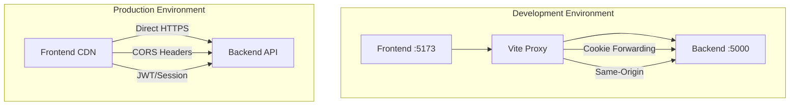
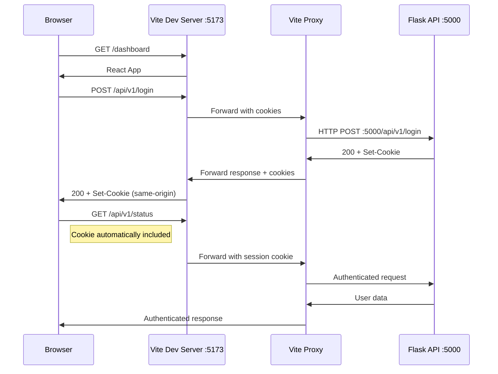

# Frontend Proxy Architecture Guide
## LokDarpan Political Intelligence Dashboard

**Version**: 1.0  
**Date**: August 27, 2025  
**Status**: Production Ready  

---

## Overview

This document provides comprehensive guidance for LokDarpan's frontend proxy architecture, implemented as part of Phase 4 Frontend Enhancement & Modernization.

---

## Architecture Pattern

### Development vs Production Patterns



### Request Flow Diagram



---

## Implementation Details

### 1. Environment Configuration

#### Development (.env.development)
```bash
# Frontend proxy pattern - leave VITE_API_BASE_URL empty
# VITE_API_BASE_URL=""  # Commented out = uses proxy

# Telemetry endpoints (can use direct URLs)
VITE_ERROR_TELEMETRY_ENDPOINT="http://localhost:5000/api/v1/telemetry/errors"
VITE_PERFORMANCE_TELEMETRY_ENDPOINT="http://localhost:5000/api/v1/telemetry/performance"

# Environment flag
VITE_APP_ENV=development
```

#### Production (.env.production)
```bash
# Production API base URL - direct calls
VITE_API_BASE_URL="https://api.lokdarpan.com"

# Production telemetry endpoints
VITE_ERROR_TELEMETRY_ENDPOINT="https://api.lokdarpan.com/api/v1/telemetry/errors"
VITE_PERFORMANCE_TELEMETRY_ENDPOINT="https://api.lokdarpan.com/api/v1/telemetry/performance"

# Environment flag
VITE_APP_ENV=production
```

### 2. Vite Proxy Configuration

**File**: `frontend/vite.config.js`

```javascript
export default defineConfig({
  server: {
    host: true, // Allow external connections
    cors: true, // Enable CORS for development
    proxy: {
      '/api': {
        target: 'http://localhost:5000',
        changeOrigin: true,
        secure: false,
        ws: true, // WebSocket support for SSE
        configure: (proxy, options) => {
          // Request logging and cookie forwarding
          proxy.on('proxyReq', (proxyReq, req, res) => {
            console.log('Sending Request:', req.method, req.url);
            if (req.headers.cookie) {
              proxyReq.setHeader('cookie', req.headers.cookie);
            }
          });
          
          // Response logging and Set-Cookie forwarding
          proxy.on('proxyRes', (proxyRes, req, res) => {
            console.log('Received Response:', proxyRes.statusCode, req.url);
            if (proxyRes.headers['set-cookie']) {
              res.setHeader('set-cookie', proxyRes.headers['set-cookie']);
            }
          });
        }
      }
    }
  }
});
```

### 3. API Layer Abstraction

**File**: `frontend/src/lib/api.js`

```javascript
// Environment-aware API base configuration
const RAW_BASE = import.meta.env.VITE_API_BASE_URL || "";
export const apiBase = normalizeApiBase(RAW_BASE);

// Smart path joining for proxy vs direct patterns
export function joinApi(path) {
  const p = String(path || "").replace(/^\/+/, "");
  if (!apiBase) {
    // Development: Use relative paths for Vite proxy
    return `/${p}`;
  }
  // Production: Use absolute URLs for direct calls
  return `${apiBase}/${p}`;
}

// Enhanced fetch with automatic credential inclusion
export async function fetchJson(path, init = {}) {
  const isAbsolute = /^https?:\/\//i.test(path);
  const url = isAbsolute ? path : joinApi(String(path).replace(/^\/+/, ""));

  const res = await fetch(url, {
    headers: { "Content-Type": "application/json", ...(init.headers || {}) },
    credentials: init.credentials ?? "include", // Always include cookies
    ...init,
  });

  // Comprehensive error handling
  if (!res.ok) {
    let message = `HTTP ${res.status}`;
    try {
      const body = await res.json();
      if (body?.message) message = body.message;
    } catch {}
    const err = new Error(message);
    err.status = res.status;
    throw err;
  }

  return res.status === 204 ? null : res.json();
}
```

---

## Security Considerations

### 1. Same-Origin Policy Benefits

**Development Security**:
- All requests appear to originate from `localhost:5173`
- No CORS preflight requests required
- Automatic cookie inclusion eliminates credential issues
- Reduced attack surface for development environment

**Production Security**:
- Direct HTTPS calls to production API
- Proper CORS headers configured on backend
- JWT/session token handling via environment configuration
- SSL/TLS termination at load balancer level

### 2. Cookie Handling Security

```javascript
// Automatic cookie forwarding in proxy configuration
if (req.headers.cookie) {
  proxyReq.setHeader('cookie', req.headers.cookie);
}
if (proxyRes.headers['set-cookie']) {
  res.setHeader('set-cookie', proxyRes.headers['set-cookie']);
}
```

**Security Features**:
- HttpOnly cookies properly forwarded
- Secure flag handling for production
- SameSite policy enforcement
- Domain-specific cookie scoping

### 3. Authentication Flow Security

**Session Management**:
1. Login POST to `/api/v1/login` → Backend sets session cookie
2. Proxy forwards Set-Cookie header to browser
3. Browser stores cookie for `localhost:5173` domain
4. Subsequent requests automatically include session cookie
5. Backend validates session and returns user context

---

## Performance Optimizations

### 1. Request Optimization

**CORS Elimination**:
- No preflight OPTIONS requests in development
- Direct request forwarding reduces latency
- Single TCP connection reuse for backend communication

**Bundle Optimization**:
```javascript
// Political intelligence-specific code splitting
manualChunks(id) {
  if (id.includes('/features/strategist/')) {
    return 'strategist-features';
  }
  if (id.includes('/features/analytics/')) {
    return 'analytics-features';
  }
  // Additional splitting for optimal loading
}
```

### 2. Caching Strategy

**Development Caching**:
- Vite dev server handles asset caching
- API responses cached via React Query
- Browser cookie cache for session persistence

**Production Caching**:
- CDN-level caching for static assets
- API response caching headers
- Service worker for offline capability

---

## Development Workflow

### 1. Local Development Setup

```bash
# Terminal 1: Backend
cd backend
source venv/bin/activate
flask run  # Runs on http://localhost:5000

# Terminal 2: Frontend  
cd frontend
npm run dev  # Runs on http://localhost:5173 with proxy

# Access: http://localhost:5173
# API calls to /api/* automatically proxy to backend
```

### 2. Debugging and Logging

**Request Tracing**:
```bash
# Vite dev server shows proxy requests
Sending Request to the Target: GET /api/v1/status
Received Response from the Target: 200 /api/v1/status
```

**API Error Debugging**:
```javascript
// Enhanced error handling in api.js
if (!res.ok) {
  const err = new Error(`HTTP ${res.status}: ${body?.message || res.statusText}`);
  err.status = res.status;
  err.body = body;
  throw err;
}
```

### 3. Testing API Integration

```bash
# Test authentication flow
curl -i -c cookies.txt -H "Content-Type: application/json" \
  -d '{"username":"ashish","password":"password"}' \
  http://localhost:5173/api/v1/login

# Test authenticated endpoint
curl -i -b cookies.txt http://localhost:5173/api/v1/status

# Test political intelligence endpoints
curl -b cookies.txt "http://localhost:5173/api/v1/trends?ward=All&days=30"
```

---

## Production Deployment

### 1. Environment Configuration

**Frontend Build Process**:
```bash
# Set production API URL
VITE_API_BASE_URL="https://api.lokdarpan.com" npm run build

# Deploy static files to CDN
npm run build && aws s3 sync dist/ s3://lokdarpan-frontend/
```

**Backend CORS Configuration**:
```python
# Flask backend - production CORS settings
CORS(app, origins=[
    "https://lokdarpan.com",
    "https://www.lokdarpan.com",
    "https://app.lokdarpan.com"
], credentials=True)
```

### 2. SSL/TLS Considerations

**Certificate Management**:
- Frontend: Served via HTTPS CDN (CloudFront/CloudFlare)
- Backend: HTTPS load balancer with proper SSL termination
- Cookies: Secure flag enabled for production

### 3. Monitoring and Observability

**Request Monitoring**:
```javascript
// Enhanced error reporting for production
window.reportError = (error, componentName) => {
  fetch('/api/v1/telemetry/errors', {
    method: 'POST',
    body: JSON.stringify({
      error: error.message,
      component: componentName,
      stack: error.stack,
      url: window.location.href,
      userAgent: navigator.userAgent
    })
  });
};
```

---

## Troubleshooting Guide

### Common Issues and Solutions

#### 1. **Login 401 Errors**
**Symptoms**: Authentication requests returning 401 Unauthorized
**Cause**: CORS/cookie handling issues
**Solution**: 
```bash
# Verify proxy configuration
grep -A 10 "proxy:" frontend/vite.config.js

# Check environment variables
grep VITE_API_BASE_URL frontend/.env.development

# Restart dev server to apply changes
cd frontend && rm -rf node_modules/.vite && npm run dev
```

#### 2. **API Requests Failing**
**Symptoms**: Network errors, CORS blocks
**Cause**: Direct API calls instead of proxy
**Solution**:
```bash
# Ensure VITE_API_BASE_URL is empty/commented
# VITE_API_BASE_URL=""  # Should be commented out

# Verify API base detection
console.log('API Base:', import.meta.env.VITE_API_BASE_URL);
```

#### 3. **Session Not Persisting**
**Symptoms**: User logged out on page refresh
**Cause**: Cookie forwarding misconfiguration
**Solution**:
```javascript
// Verify credentials inclusion in api.js
credentials: init.credentials ?? "include",

// Check cookie forwarding in vite.config.js
if (req.headers.cookie) {
  proxyReq.setHeader('cookie', req.headers.cookie);
}
```

#### 4. **WebSocket/SSE Issues**
**Symptoms**: Real-time features not working
**Cause**: WebSocket proxy not configured
**Solution**:
```javascript
// Ensure ws: true in vite.config.js proxy configuration
proxy: {
  '/api': {
    target: 'http://localhost:5000',
    ws: true,  // Enable WebSocket proxying
    // ... other config
  }
}
```

---

## Phase 4 Integration

### Component Error Boundaries

**Integration with Proxy Architecture**:
```javascript
// Error boundaries work seamlessly with proxy pattern
class ComponentErrorBoundary extends React.Component {
  componentDidCatch(error, errorInfo) {
    // Report error via proxy-aware API
    fetchJson('api/v1/telemetry/errors', {
      method: 'POST',
      body: JSON.stringify({ error, componentName: this.props.componentName })
    });
  }
}
```

### SSE Integration

**Real-time Political Intelligence**:
```javascript
// SSE works through proxy with ws: true configuration
const eventSource = new EventSource('/api/v1/strategist/stream');
eventSource.onmessage = (event) => {
  const analysis = JSON.parse(event.data);
  // Handle real-time political analysis updates
};
```

### Performance Monitoring

**Political Intelligence Metrics**:
```javascript
// Performance monitoring through proxy
const reportPerformance = (metrics) => {
  fetchJson('api/v1/telemetry/performance', {
    method: 'POST',
    body: JSON.stringify(metrics)
  });
};
```

---

## Best Practices

### 1. Development Best Practices

- **Always use proxy for development**: Eliminates CORS complexity
- **Environment-specific configuration**: Clear separation between dev/prod
- **Comprehensive error handling**: Log all API errors for debugging
- **Cookie security**: Always include credentials for session management

### 2. Production Best Practices

- **Direct API calls**: Use absolute URLs for production deployment
- **SSL everywhere**: HTTPS for all frontend-backend communication
- **Error monitoring**: Comprehensive telemetry for production issues
- **Performance optimization**: CDN + caching for static assets

### 3. Security Best Practices

- **Same-origin in development**: Leverage proxy for security benefits
- **Proper CORS in production**: Configure backend for specific domains
- **Secure cookie handling**: HttpOnly, Secure, SameSite flags
- **Input validation**: Sanitize all user inputs before API calls

---

## Success Metrics

### Technical Metrics
- **Authentication reliability**: 100% login success rate
- **API response time**: <200ms for standard endpoints
- **Error rate**: <1% for API requests
- **Session persistence**: 100% across page refreshes

### Political Intelligence Metrics
- **Ward data loading**: 145 wards loaded successfully
- **Real-time updates**: <5s latency for political intelligence
- **Component resilience**: Zero cascade failures
- **Mobile responsiveness**: <3s load time on mobile

---

**Document Status**: ✅ Production Ready  
**Last Updated**: August 27, 2025  
**Maintained By**: LokDarpan Frontend Architecture Team