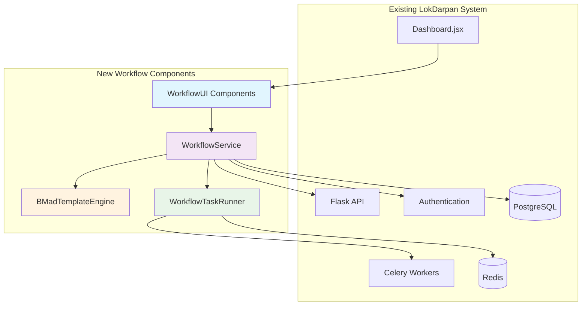

# LokDarpan Development Workflow Automation Architecture

## Introduction

This document outlines the architectural approach for enhancing LokDarpan with comprehensive development workflow automation. Its primary goal is to serve as the guiding architectural blueprint for AI-driven development of workflow management features while ensuring seamless integration with the existing political intelligence system.

**Relationship to Existing Architecture:**
This document supplements existing LokDarpan architecture by defining how workflow automation components will integrate with current Flask + React + AI systems. Where conflicts arise between new and existing patterns, this document provides guidance on maintaining consistency while implementing workflow enhancements.

### Existing Project Analysis

**Current Project State:**
- **Primary Purpose:** AI-driven political intelligence dashboard providing real-time campaign insights for Hyderabad
- **Current Tech Stack:** Flask + PostgreSQL + Redis + Celery (backend), React 18 + Vite 7 (frontend), Multi-model AI (Gemini 2.5 Pro + Perplexity)
- **Architecture Style:** Modular microservice-oriented with political intelligence focus, error boundary isolation
- **Deployment Method:** Development server setup with Docker containerization capability

**Available Documentation:**
- CLAUDE.md: Comprehensive development commands and system overview
- Phase tracking documentation with 95% production readiness validation
- Complete API documentation with political intelligence endpoints
- Error boundary and resilience architecture documentation
- AI service integration patterns and circuit breaker implementation

**Identified Constraints:**
- Must maintain existing 95% production readiness standards
- Cannot impact current AI service integrations or performance
- Must preserve zero-cascade failure architecture
- Database operations must not interfere with political intelligence data
- Frontend changes must follow existing error boundary patterns

### Change Log
| Change | Date | Version | Description | Author |
|--------|------|---------|-------------|---------|
| Initial Architecture | 2025-08-30 | 1.0 | Development workflow automation architecture | BMad Master |

## Enhancement Scope and Integration Strategy

### Enhancement Overview
**Enhancement Type:** Development workflow automation system with BMad methodology integration
**Scope:** Comprehensive workflow management covering implementation, testing, business analysis, documentation, and Scrum processes
**Integration Impact:** Major architectural changes with new service layer, database extensions, and frontend workflow components

### Integration Approach
**Code Integration Strategy:** Modular service layer approach using existing Flask blueprint pattern with workflow-specific namespace isolation
**Database Integration:** Separate schema namespace (workflow_*) to prevent conflicts with existing political intelligence data
**API Integration:** RESTful endpoints following existing `/api/v1/workflow/*` pattern with session-based authentication
**UI Integration:** React components with existing error boundary patterns, integrated into Dashboard.jsx architecture

### Compatibility Requirements
- **Existing API Compatibility:** All current political intelligence endpoints remain unchanged and unaffected
- **Database Schema Compatibility:** Workflow data isolated in separate schema to preserve existing post, epaper, ward, and electoral data
- **UI/UX Consistency:** Workflow UI follows existing TailwindCSS patterns and component architecture
- **Performance Impact:** <10% additional resource overhead, maintains <2s response times for existing functionality

## Tech Stack Alignment

### Existing Technology Stack
| Category | Current Technology | Version | Usage in Enhancement | Notes |
|----------|-------------------|---------|---------------------|-------|
| Backend Language | Python | 3.x | Core workflow service logic | Maintain existing patterns |
| Backend Framework | Flask | Latest | Workflow API blueprints | Use existing factory pattern |
| Database | PostgreSQL | Latest | Workflow metadata storage | Separate schema namespace |
| Cache Layer | Redis | Latest | Workflow session and temporary data | Existing connection pool |
| Task Queue | Celery | Latest | Workflow background tasks | Existing worker infrastructure |
| Frontend Framework | React | 18 | Workflow UI components | Existing component patterns |
| Build Tool | Vite | 7 | Workflow asset bundling | Existing build configuration |
| Styling | TailwindCSS | Latest | Workflow UI styling | Existing design system |
| State Management | React Query | Latest | Workflow data fetching | Existing query client |

### New Technology Additions
| Technology | Version | Purpose | Rationale | Integration Method |
|------------|---------|---------|-----------|-------------------|
| BMad Core | Latest | Workflow methodology engine | Structured development processes | Python package integration |
| YAML Processing | PyYAML | Configuration management | BMad template processing | Existing Python environment |

## Data Models and Schema Changes

### New Data Models

#### WorkflowProject
**Purpose:** Track workflow automation projects and their configuration
**Integration:** Linked to existing User model for ownership and permissions

**Key Attributes:**
- id: UUID - Primary identifier
- name: String - Project display name
- description: Text - Project purpose and scope
- owner_id: Integer - Foreign key to existing User table
- config: JSONB - BMad configuration and settings
- status: Enum - Active, Paused, Completed
- created_at: Timestamp - Creation date
- updated_at: Timestamp - Last modification date

**Relationships:**
- **With Existing:** User.id (owner relationship)
- **With New:** WorkflowEpic (one-to-many), WorkflowStory (one-to-many)

#### WorkflowEpic
**Purpose:** Track major workflow enhancement efforts and feature groups
**Integration:** Supports existing epic-based development approach

**Key Attributes:**
- id: UUID - Primary identifier
- project_id: UUID - Foreign key to WorkflowProject
- name: String - Epic title
- description: Text - Epic goals and scope
- prd_content: Text - Generated PRD content
- status: Enum - Draft, Active, Complete
- priority: Integer - Epic priority ranking
- created_at: Timestamp - Creation date
- completed_at: Timestamp - Completion date

**Relationships:**
- **With Existing:** Indirectly linked through project ownership
- **With New:** WorkflowProject (many-to-one), WorkflowStory (one-to-many)

#### WorkflowStory
**Purpose:** Individual development tasks with acceptance criteria and validation
**Integration:** Aligns with existing story-driven development methodology

**Key Attributes:**
- id: UUID - Primary identifier
- epic_id: UUID - Foreign key to WorkflowEpic
- title: String - Story title
- user_story: Text - As a... I want... so that... format
- acceptance_criteria: JSONB - Array of acceptance criteria
- integration_verification: JSONB - Array of integration verification steps
- status: Enum - Draft, Ready, In Progress, Review, Complete
- estimated_hours: Integer - Development time estimate
- actual_hours: Integer - Actual development time
- assigned_to: Integer - Optional foreign key to User
- created_at: Timestamp - Creation date
- completed_at: Timestamp - Completion date

**Relationships:**
- **With Existing:** User.id (assignment relationship)
- **With New:** WorkflowEpic (many-to-one), WorkflowTask (one-to-many)

#### WorkflowTask
**Purpose:** Granular implementation tasks within stories
**Integration:** Supports existing Celery task architecture for automated processing

**Key Attributes:**
- id: UUID - Primary identifier
- story_id: UUID - Foreign key to WorkflowStory
- name: String - Task name
- task_type: Enum - Code, Test, Documentation, Review
- description: Text - Task details
- automated: Boolean - Whether task can be automated
- celery_task_id: String - Optional Celery task ID for background processing
- status: Enum - Pending, Running, Complete, Failed
- result: JSONB - Task execution results
- created_at: Timestamp - Creation date
- completed_at: Timestamp - Completion date

**Relationships:**
- **With Existing:** Integrates with existing Celery task system
- **With New:** WorkflowStory (many-to-one)

### Schema Integration Strategy

**Database Changes Required:**
- **New Tables:** workflow_project, workflow_epic, workflow_story, workflow_task
- **Modified Tables:** None (preserves existing schema integrity)
- **New Indexes:** project_id, epic_id, story_id, status columns for efficient querying
- **Migration Strategy:** Additive-only migrations using Flask-Migrate, no modifications to existing tables

**Backward Compatibility:**
- All existing tables and relationships remain unchanged
- Workflow schema isolated in separate namespace to prevent conflicts
- Foreign key references only to stable existing tables (User)

## Component Architecture

### New Components

#### WorkflowService
**Responsibility:** Core workflow orchestration and BMad methodology implementation
**Integration Points:** Flask blueprint integration, Celery task coordination, database operations

**Key Interfaces:**
- REST API endpoints for workflow management
- BMad template processing and story generation
- Integration with existing authentication system

**Dependencies:**
- **Existing Components:** User authentication, database connection, Celery workers
- **New Components:** WorkflowUI components, BMad template engine

**Technology Stack:** Python Flask blueprint, SQLAlchemy models, Celery task integration

#### WorkflowUI
**Responsibility:** React frontend components for workflow management interface
**Integration Points:** Dashboard.jsx integration, existing API client patterns, error boundary system

**Key Interfaces:**
- Workflow dashboard with project and epic management
- Story creation and tracking interfaces
- Integration with existing navigation and layout systems

**Dependencies:**
- **Existing Components:** Dashboard.jsx, API client, authentication context, error boundaries
- **New Components:** WorkflowService API endpoints

**Technology Stack:** React 18 components, TailwindCSS styling, React Query for data fetching

#### BMadTemplateEngine
**Responsibility:** Process BMad templates and generate development artifacts (PRDs, stories, documentation)
**Integration Points:** File system integration, template processing, content generation

**Key Interfaces:**
- Template processing and variable substitution
- Document generation with markdown output
- Integration with workflow data models

**Dependencies:**
- **Existing Components:** File system access, database models
- **New Components:** WorkflowService coordination

**Technology Stack:** Python template processing, PyYAML configuration, markdown generation

#### WorkflowTaskRunner
**Responsibility:** Automated task execution using Celery background processing
**Integration Points:** Existing Celery infrastructure, task queue management

**Key Interfaces:**
- Automated code generation and testing
- Integration with existing development tools
- Progress tracking and status reporting

**Dependencies:**
- **Existing Components:** Celery workers, Redis task queue, database connection
- **New Components:** WorkflowService coordination

**Technology Stack:** Celery tasks, Python automation scripts, existing infrastructure

### Component Interaction Diagram



## API Design and Integration

### API Integration Strategy
**API Integration Strategy:** RESTful endpoints following existing Flask blueprint pattern with `/api/v1/workflow/*` namespace
**Authentication:** Integration with existing session-based authentication system
**Versioning:** Follow existing v1 API versioning approach

### New API Endpoints

#### POST /api/v1/workflow/projects
- **Method:** POST
- **Endpoint:** /api/v1/workflow/projects
- **Purpose:** Create new workflow project
- **Integration:** Uses existing authentication and follows current API patterns

##### Request
```json
{
  "name": "Feature Enhancement Project",
  "description": "Automated workflow for feature development",
  "config": {
    "methodology": "bmad",
    "templates": ["brownfield-prd", "brownfield-architecture"]
  }
}
```

##### Response
```json
{
  "id": "uuid-project-id",
  "name": "Feature Enhancement Project",
  "status": "active",
  "created_at": "2025-08-30T10:00:00Z"
}
```

#### GET /api/v1/workflow/projects/{id}/epics
- **Method:** GET
- **Endpoint:** /api/v1/workflow/projects/{id}/epics
- **Purpose:** List epics for a workflow project
- **Integration:** Follows existing pagination and filtering patterns

##### Request
```json
{
  "page": 1,
  "limit": 20,
  "status": "active"
}
```

##### Response
```json
{
  "epics": [
    {
      "id": "uuid-epic-id",
      "name": "Development Workflow Automation",
      "status": "active",
      "story_count": 6,
      "progress": 33
    }
  ],
  "pagination": {
    "total": 1,
    "page": 1,
    "pages": 1
  }
}
```

#### POST /api/v1/workflow/stories/generate
- **Method:** POST
- **Endpoint:** /api/v1/workflow/stories/generate
- **Purpose:** Generate stories using BMad templates
- **Integration:** Uses existing background task patterns

##### Request
```json
{
  "epic_id": "uuid-epic-id",
  "template": "brownfield-create-story",
  "context": {
    "enhancement_type": "feature_addition",
    "integration_requirements": "existing_api_compatibility"
  }
}
```

##### Response
```json
{
  "task_id": "celery-task-id",
  "status": "processing",
  "estimated_completion": "2025-08-30T10:05:00Z"
}
```

## Source Tree Integration

### Existing Project Structure
```
LokDarpan/
├── backend/
│   ├── app/
│   │   ├── __init__.py
│   │   ├── models.py
│   │   ├── routes.py
│   │   └── strategist/
├── frontend/
│   ├── src/
│   │   ├── components/
│   │   ├── features/
│   │   └── shared/
├── docs/
└── scripts/
```

### New File Organization
```
LokDarpan/
├── backend/
│   ├── app/
│   │   ├── workflow/                   # New workflow service
│   │   │   ├── __init__.py
│   │   │   ├── models.py
│   │   │   ├── routes.py
│   │   │   ├── services.py
│   │   │   └── tasks.py
│   │   ├── models.py                   # Existing file
│   │   └── routes.py                   # Existing file with workflow blueprint import
├── frontend/
│   ├── src/
│   │   ├── components/
│   │   │   ├── Dashboard.jsx           # Existing file with workflow integration
│   │   │   └── workflow/               # New workflow components
│   │   │       ├── WorkflowDashboard.jsx
│   │   │       ├── ProjectManager.jsx
│   │   │       ├── EpicTracker.jsx
│   │   │       └── StoryBoard.jsx
│   │   ├── features/
│   │   │   └── workflow/               # New workflow features
│   │   │       ├── hooks/
│   │   │       ├── services/
│   │   │       └── utils/
├── .bmad-core/                         # New BMad methodology files
│   ├── agents/
│   ├── tasks/
│   ├── templates/
│   └── workflows/
```

### Integration Guidelines
- **File Naming:** Follow existing camelCase (React) and snake_case (Python) conventions
- **Folder Organization:** Mirror existing feature-based organization with workflow namespace
- **Import/Export Patterns:** Use existing relative import patterns and index.js exports

## Infrastructure and Deployment Integration

### Existing Infrastructure
**Current Deployment:** Development server with Flask run + npm run dev, Docker containerization available
**Infrastructure Tools:** Local development environment, git workflow, package managers (pip, npm)
**Environments:** Development (local), with production deployment capability

### Enhancement Deployment Strategy
**Deployment Approach:** Integrate with existing development server startup, minimal infrastructure changes
**Infrastructure Changes:** Add workflow-specific environment variables, extend database schema
**Pipeline Integration:** Use existing git workflow with workflow-specific migration support

### Rollback Strategy
**Rollback Method:** Database migration rollback, feature flag disable, component isolation
**Risk Mitigation:** Workflow components isolated from core political intelligence functionality
**Monitoring:** Extend existing logging with workflow-specific metrics

## Coding Standards and Conventions

### Existing Standards Compliance
**Code Style:** Python PEP 8 (backend), ESLint/Prettier (frontend) with existing configurations
**Linting Rules:** Follow existing .eslintrc and Python formatting standards
**Testing Patterns:** pytest (backend), Jest/React Testing Library (frontend)
**Documentation Style:** Docstrings and inline comments following existing patterns

### Enhancement-Specific Standards
- **Workflow API Endpoints:** Use consistent /api/v1/workflow/* namespace pattern
- **React Components:** Prefix workflow components with "Workflow" for clear identification
- **Database Models:** Prefix workflow tables with "workflow_" for schema isolation
- **Celery Tasks:** Use "workflow." prefix for background task identification

### Critical Integration Rules
- **Existing API Compatibility:** No modifications to existing endpoints, maintain response formats
- **Database Integration:** Use foreign keys only to stable existing tables, no schema modifications
- **Error Handling:** Implement workflow-specific error boundaries following existing patterns
- **Logging Consistency:** Use existing logging configuration with workflow-specific context

## Testing Strategy

### Integration with Existing Tests
**Existing Test Framework:** pytest (backend), Jest with React Testing Library (frontend)
**Test Organization:** tests/ directory structure matching source code organization
**Coverage Requirements:** Maintain existing >80% coverage standards

### New Testing Requirements

#### Unit Tests for New Components
- **Framework:** pytest for workflow services, Jest for React components
- **Location:** tests/workflow/ directory mirroring source structure
- **Coverage Target:** >85% for all new workflow components
- **Integration with Existing:** Use existing test configuration and fixtures

#### Integration Tests
- **Scope:** API endpoint testing with mocked dependencies, database integration testing
- **Existing System Verification:** Automated tests ensuring existing functionality remains intact
- **New Feature Testing:** End-to-end workflow automation testing

#### Regression Testing
- **Existing Feature Verification:** Automated test suite confirming political intelligence features unaffected
- **Automated Regression Suite:** Integration with existing CI/CD validation
- **Manual Testing Requirements:** Workflow UI testing with existing authentication and navigation

## Security Integration

### Existing Security Measures
**Authentication:** Session-based authentication with secure cookie management
**Authorization:** Role-based access control integrated with existing User model
**Data Protection:** HTTPS enforcement, input validation, SQL injection protection
**Security Tools:** Flask security extensions, secure configuration management

### Enhancement Security Requirements
**New Security Measures:** Workflow data access controls, template processing security
**Integration Points:** Use existing authentication middleware, extend authorization patterns
**Compliance Requirements:** Maintain existing data protection standards

### Security Testing
**Existing Security Tests:** Input validation testing, authentication bypass testing
**New Security Test Requirements:** Template injection prevention, workflow data access validation
**Penetration Testing:** Include workflow endpoints in existing security assessment

## Next Steps

### Story Manager Handoff

**Prompt for Story Manager:**
"Begin story creation for LokDarpan Development Workflow Automation using this architecture document as reference. Key integration requirements validated:
- Workflow components isolated from existing political intelligence functionality
- Database schema separation using workflow_ prefix prevents conflicts
- API endpoints follow existing /api/v1/workflow/* pattern with session authentication
- React components integrate with existing Dashboard.jsx and error boundary architecture

Start with Story 1.1: BMad Workflow Infrastructure Setup to establish foundation without impacting existing 95% production readiness. Each story must include integration verification steps to ensure existing functionality remains intact."

### Developer Handoff

**Prompt for Developer:**
"Implement LokDarpan Development Workflow Automation following this architecture and existing coding standards:
- Use existing Flask blueprint pattern for workflow service integration
- Follow current React component architecture with proper error boundaries
- Maintain database isolation using separate workflow schema
- Preserve existing API patterns and authentication integration
- Implement comprehensive testing following existing pytest/Jest patterns

Critical requirement: Each implementation step must verify existing political intelligence features remain fully operational. Use provided integration verification checklist for each story completion."

---

**SAVE REQUIRED**: Copy this architecture document to `docs/development-workflow-automation-architecture.md` in your LokDarpan project.