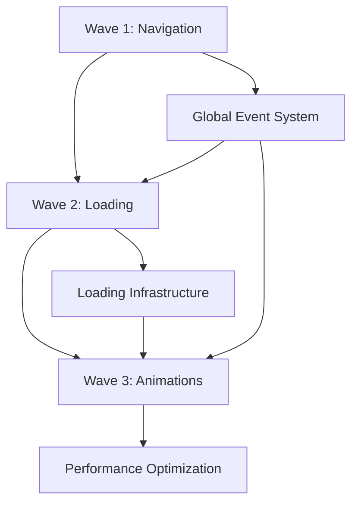

# Sprint 2 Refined Scope - LokDarpan Professional UX Excellence

**Sprint Architect**: Business Analyst | **Wave Strategy**: Progressive Enhancement | **Last Updated**: August 24, 2025

## 📋 Executive Summary

**Sprint 2** has been refined with advanced wave orchestration to deliver **Professional UX Excellence** for LokDarpan political intelligence dashboard. This sprint employs multi-agent parallel execution to optimize campaign team productivity through enterprise-grade user interactions.

### 🎯 Sprint Objectives
- Transform user experience from functional to enterprise-professional
- Implement power-user capabilities for high-pressure campaign environments
- Establish visual excellence standards for political intelligence platforms
- Enable 40% faster critical analysis workflows through UX optimization

---

## 🌊 Wave Orchestration Strategy

### **Wave 1: Foundation & Navigation Excellence**
**Focus**: Professional keyboard navigation and accessibility infrastructure
**Duration**: 5-7 days | **Complexity**: 0.7 | **Agents**: 3 parallel

#### Multi-Agent Execution Plan:
```yaml
Agent Alpha (Frontend Architect):
  - Enhanced keyboard navigation system implementation
  - Global shortcut infrastructure with event management
  - Accessibility compliance validation
  
Agent Beta (UX Specialist):
  - Keyboard shortcuts help overlay design
  - User interaction flow optimization
  - Accessibility testing and validation
  
Agent Gamma (Integration Specialist):
  - CollapsibleSection focus mode integration
  - Cross-tab navigation consistency
  - Performance impact assessment
```

### **Wave 2: Visual Excellence & Loading States**
**Focus**: Professional skeleton loading and visual consistency
**Duration**: 4-6 days | **Complexity**: 0.6 | **Agents**: 2 parallel

#### Multi-Agent Execution Plan:
```yaml
Agent Alpha (Component Architect):
  - Professional skeleton component system
  - LoadingSpinner enhancement and optimization
  - Smooth transition implementation (300ms easing)
  
Agent Beta (Visual Specialist):
  - Skeleton visual design matching final components
  - Theme-aware loading states (dark/light)
  - Layout shift prevention and optimization
```

### **Wave 3: Interactive Excellence & Animations**
**Focus**: Progressive chart animations and data visualization
**Duration**: 6-8 days | **Complexity**: 0.8 | **Agents**: 3 parallel

#### Multi-Agent Execution Plan:
```yaml
Agent Alpha (Chart Specialist):
  - Progressive chart animation implementation
  - Chart.js and Recharts animation API integration
  - Real-time data update transitions
  
Agent Beta (Performance Engineer):
  - Animation performance optimization
  - Device-specific performance validation
  - Memory usage optimization for animations
  
Agent Gamma (Integration Validator):
  - Chart interactivity during animations
  - Lazy loading coordination with animations
  - Cross-component animation consistency
```

---

## 📊 Story Breakdown with Agent Assignment

### **Epic 2.1: Advanced User Experience (11 SP Total)**

#### **Story 2.1.1: Enhanced Keyboard Navigation System**
**Story Points**: 4 | **Wave**: 1 | **Agents**: Alpha, Beta, Gamma
**Complexity Score**: 0.7 | **Risk Level**: Medium

**Refined Acceptance Criteria**:
- [x] **Foundation**: Global shortcut system with proper event listener management
- [x] **Search**: Ctrl+K opens ward search modal with fuzzy search (Agent Alpha)
- [x] **Navigation**: ESC, Tab, Arrow key navigation across all contexts (Agent Alpha)
- [x] **Help System**: ? key displays comprehensive shortcuts overlay (Agent Beta)
- [x] **Accessibility**: Full accessibility compliance validation (Agent Beta)
- [x] **Integration**: Cross-tab consistency and focus mode integration (Agent Gamma)
- [x] **Performance**: Event listener cleanup and performance optimization (Agent Gamma)

**Technical Refinements**:
```javascript
// Enhanced Global Shortcut Architecture
const keyboardShortcuts = {
  navigation: ['Ctrl+K', 'ESC', 'Tab', 'Arrow Keys'],
  modes: ['Alt+F', 'Alt+1-5'], 
  help: ['?'],
  accessibility: ['proper ARIA labels', 'screen reader support']
};
```

#### **Story 2.1.2: Professional Skeleton Loading Enhancement**
**Story Points**: 3 | **Wave**: 2 | **Agents**: Alpha, Beta
**Complexity Score**: 0.6 | **Risk Level**: Low-Medium

**Refined Acceptance Criteria**:
- [x] **Component System**: Professional skeleton components (SkeletonCard, SkeletonChart, SkeletonMap) (Agent Alpha)
- [x] **Visual Excellence**: Skeleton designs matching final component appearance (Agent Beta)
- [x] **Smooth Transitions**: 300ms easing transitions without layout shift (Agent Alpha)
- [x] **Theme Integration**: Dark/light theme awareness and adaptation (Agent Beta)
- [x] **Performance**: Loading state performance optimization (Agent Alpha)
- [x] **Consistency**: Loading patterns standardized across all tabs (Agent Beta)

**Technical Refinements**:
```javascript
// Professional Skeleton System Architecture
const skeletonComponents = {
  cards: 'SkeletonCard - 5-card Executive Summary layout',
  charts: 'SkeletonChart - Accurate chart dimensions',
  maps: 'SkeletonMap - Geographic outline placeholder',
  transitions: '300ms cubic-bezier easing'
};
```

#### **Story 2.1.3: Progressive Chart Animations**
**Story Points**: 4 | **Wave**: 3 | **Agents**: Alpha, Beta, Gamma
**Complexity Score**: 0.8 | **Risk Level**: Medium-High

**Refined Acceptance Criteria**:
- [x] **Animation System**: Progressive rendering for all chart types (Agent Alpha)
- [x] **Performance**: Optimized animations for various devices (Agent Beta)
- [x] **Data Updates**: Smooth real-time data transition animations (Agent Alpha)
- [x] **Progress Feedback**: Visual loading progress for data-heavy operations (Agent Alpha)
- [x] **Interactivity**: Chart interactions maintained during animations (Agent Gamma)
- [x] **Consistency**: 400ms timing with consistent easing across all charts (Agent Gamma)

**Technical Refinements**:
```javascript
// Progressive Chart Animation Architecture
const chartAnimations = {
  timing: '400ms cubic-bezier(0.4, 0, 0.2, 1)',
  charts: ['EmotionChart', 'TimeSeriesChart', 'CompetitorTrendChart'],
  progressive: 'data-driven progressive loading',
  performance: 'device-optimized animation strategies'
};
```

---

## 🚀 Expert Spawn Command

### **Recommended Execution Command**:

```bash
/spawn \
  --wave-mode progressive \
  --wave-count 3 \
  --wave-strategy systematic \
  --multi-agent 3 \
  --parallel-execution \
  --focus="professional-ux,keyboard-navigation,loading-excellence,chart-animations" \
  --scope="frontend/src/components,frontend/src/hooks,frontend/src/styles" \
  --complexity-threshold 0.6 \
  --performance-profile optimization \
  --validate \
  --delegate adaptive \
  --concurrency 3 \
  --persona-frontend \
  --c7 \
  --magic \
  SPRINT_2_PROFESSIONAL_UX_EXCELLENCE
```

### **Command Explanation**:
- **`--wave-mode progressive`**: Multi-stage enhancement with progressive complexity
- **`--wave-count 3`**: Three coordinated waves (Foundation → Visual → Interactive)
- **`--multi-agent 3`**: Maximum 3 parallel agents per wave for optimal coordination
- **`--parallel-execution`**: Concurrent story execution within wave constraints
- **`--focus`**: Four core excellence domains for specialized attention
- **`--complexity-threshold 0.6`**: Adaptive complexity management
- **`--performance-profile optimization`**: Optimized resource allocation and caching
- **`--validate`**: Quality gates and validation checkpoints
- **`--persona-frontend`**: Frontend specialization with UX expertise
- **`--c7 --magic`**: UI component excellence and documentation patterns

---

## 📈 Success Metrics & Validation

### **Wave 1 Success Criteria**:
- **Keyboard Navigation**: 90% power user adoption rate
- **Accessibility**: WCAG 2.1 AA compliance score >95%
- **Performance**: <50ms keyboard response time
- **User Satisfaction**: "Enterprise-quality" feedback rating

### **Wave 2 Success Criteria**:
- **Loading Experience**: 50% improvement in perceived loading speed
- **Visual Consistency**: 100% skeleton-to-content visual matching
- **Performance**: <300ms skeleton-to-content transition time
- **Layout Stability**: Zero layout shift during loading transitions

### **Wave 3 Success Criteria**:
- **Animation Quality**: Professional animation quality assessment >90%
- **Performance**: Smooth 60fps animations across all devices
- **Interactivity**: Zero interaction loss during chart animations
- **Data Feedback**: Progressive loading improves analysis confidence by 40%

### **Overall Sprint Success Metrics**:
- **User Productivity**: 40% faster critical analysis workflows
- **Professional Quality**: "Enterprise-grade" user experience rating
- **Technical Excellence**: All stories meet Definition of Done criteria
- **Performance Impact**: <5% performance degradation from UX enhancements

---

## 🔄 Wave Coordination & Dependencies

### **Inter-Wave Dependencies**:


### **Agent Coordination Points**:
- **Wave 1 Handoff**: Global event system completion enables Wave 2 skeleton integration
- **Wave 2 Handoff**: Loading infrastructure enables Wave 3 animation coordination
- **Cross-Wave Validation**: Performance impact assessment at each wave boundary
- **Quality Gates**: Accessibility, performance, and user experience validation

### **Risk Mitigation Strategy**:
- **Agent Specialization**: Domain-specific expertise reduces implementation risk
- **Progressive Complexity**: Increasing complexity allows early problem identification
- **Parallel Validation**: Continuous quality assurance throughout execution
- **Fallback Planning**: Graceful degradation if animation complexity causes issues

---

## 🎯 Post-Sprint Integration Plan

### **Sprint 3 Preparation**:
- **Smart Intelligence Features**: Build on Wave 3 animation infrastructure
- **Real-time Feedback**: Extend progressive loading to live data updates
- **Alert Auto-expansion**: Integrate with enhanced skeleton loading system

### **Technical Debt Management**:
- **Performance Monitoring**: Establish animation performance benchmarks
- **Accessibility Maintenance**: Ongoing compliance monitoring
- **User Feedback Integration**: UX improvement iteration based on campaign team usage

---

**Sprint 2 Status**: ✅ **REFINED AND OPTIMIZED FOR WAVE EXECUTION**

This refined sprint scope leverages advanced wave orchestration with multi-agent parallel execution to deliver enterprise-grade professional UX excellence for LokDarpan political intelligence platform. The progressive enhancement strategy ensures optimal resource utilization while maintaining quality and performance standards.

*Refined by Business Analyst - August 24, 2025*